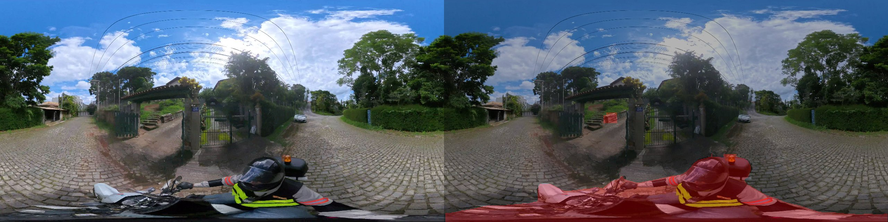
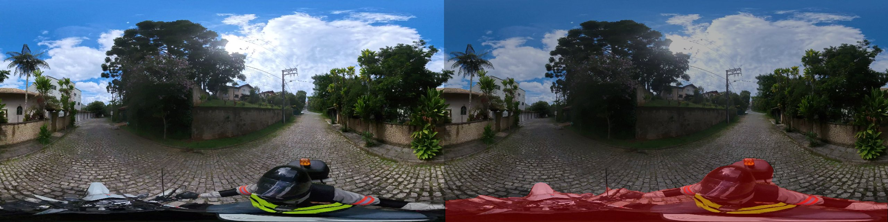
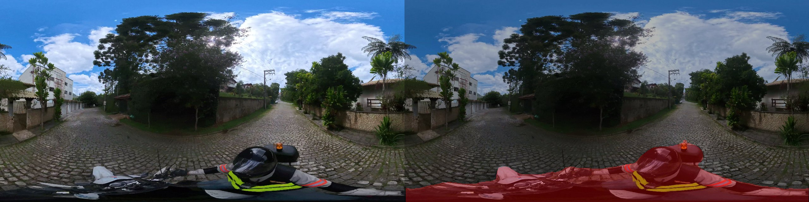
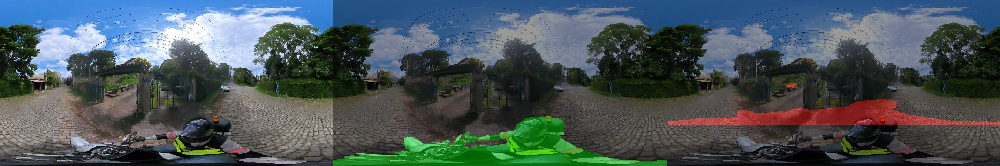

# 360 Segmentation Pipeline

Projeto teste da empresa **Robotitech**   

Pipeline de visão computacional para **segmentação de motocicleta e condutor em imagens 360° (equiretangulares)**, com geração automática de anotações, reprojeção geométrica e treinamento de modelo especialista.

---

## 📋 Relatório Final da Avaliação Robotitech

- **Gestão de Dependências**: No arquivo `pyproject.toml`, ausência de versões específicas das bibliotecas, comprometendo estabilidade e reprodutibilidade.
- **Tratamento de Exceções e Validações**: Falta de blocos `try/except`; função `load_config` não verifica existência do arquivo antes da leitura.
- **Validação de Entradas**: Sistema processa apenas JPG e PNG, mas não emite alertas ou trata exceções para outros formatos.
- **Orientação a Objetos e Encapsulamento**:
  - Encapsulamento inconsistente na classe `ViewExtractor`.
  - Classe `YOLODatasetBuilder` com alvo hardcoded, quebrando a genericidade.
- **Design e Uso de Módulos**: Módulo de configuração criado, mas não integrado aos scripts.
- **Monitoramento**: Uso de `print` em vez de biblioteca de logging.
- **Boas Práticas de Código e Padronização**:
  - Variáveis globais em scripts podem causar efeitos colaterais.
  - Falta de padrão estrutural entre scripts e nomes de funções (ex: `run_annotations` realiza extração de vistas).
  - Ausência de docstrings padronizadas e descritivas.

---

## 🎯 Objetivo

Este projeto implementa um pipeline completo para:

* Extração de vistas perspectiva a partir de imagens 360°
* Segmentação automática (zero-shot)
* Reprojeção para o espaço equiretangular
* Refinamento de máscaras
* Treinamento de modelo especialista
* Exportação para ONNX e avaliação em CPU

---

## 🧠 Observações do Dataset

* Imagens no formato **equiretangular (2:1)**
* Resolução típica: **5760 x 2880**
* Os objetos de interesse (motocicleta e condutor) estão localizados predominantemente na região inferior (**nadir/polo sul**)

---

## ⚙️ Estratégia

Ao invés de processar toda a esfera, o pipeline utiliza uma abordagem otimizada:

* Extração de vistas perspectiva focadas no nadir
* Redução de ruído e custo computacional
* Melhor cobertura da região relevante para segmentação

---

## 📦 Estrutura do Projeto

```
data/
  raw/                imagens originais
  intermediate/       vistas e máscaras intermediárias
  processed/          dataset final

src/
  extraction/         conversão 360° → perspectiva
  segmentation/       modelos zero-shot
  reprojection/       volta para equiretangular
  refinement/         pós-processamento
  training/           treino do modelo
  evaluation/         métricas e benchmark

scripts/
  run_annotation.py        extração de vistas
  run_segmentation.py      segmentação + reprojeção + fusão
  run_dataset_builder.py   máscaras -> dataset YOLO-seg
  run_training.py          treino do modelo especialista
  export_onnx.py           best.pt -> ONNX
  run_inference_onnx.py    avaliação em CPU + exemplos

tools/
  scripts auxiliares para debug e exploração
```

---

## 🚀 Pipeline atual

### ✔ Extração de vistas

Três modos disponíveis via [configs/pipeline.yaml](configs/pipeline.yaml):

* `single`: uma vista (yaw + pitch escalares).
* `nadir_multi`: N yaws com pitch fixo (default: pitch=-85, yaws=[0, 120, 240]).
  Foi o modo usado para gerar as máscaras do nadir, com overlap entre as três
  vistas alimentando a fusão.
* `grid`: varredura por incrementos de yaw e pitch (`yaw_step`, `pitch_step`).
  Os polos exatos são pulados, porque a perspectiva degenera lá.

Cada vista inclui imagem perspectiva + metadados (yaw, pitch, FOV, tamanho).
Processamento em lote: ~300 imagens em ~47s no modo `nadir_multi`.

### ✔ Segmentação zero-shot (LangSAM)

* Prompt textual (ex: `"person on a motorcycle"`)
* Inferência por vista plana, onde a distorção é menor do que no equiretangular cru

### ✔ Reprojeção e fusão equiretangular

* Inverse mapping vetorizado com `cv2.remap`
* Fusão por voto com threshold configurável

### ✔ Refinamento clássico

* Morfologia OPEN seguida de CLOSE (remove ruído isolado e fecha buracos)
* Filtro por componente conexo: descarta blobs com área menor que `min_area`
* GrabCut opcional, refina contornos a partir do bounding box do maior componente

### ✔ Treinamento (YOLOv8-seg)

* Builder converte `(imagem 360°, máscara)` em formato YOLO-seg (polígonos
  normalizados) com split 80/20
* Treino feito com transfer learning a partir do `yolov8n-seg.pt`
* Classe única `motorcycle_person` — moto e condutor tratados como bloco
  único (ver nota abaixo)

### ✔ Exportação ONNX + benchmark CPU

* `best.pt` exportado para `.onnx` via `model.export(format="onnx")`
* Inferência via `ONNXSegmenter` carregado pelo wrapper do ultralytics, com
  `CPUExecutionProvider` do `onnxruntime`
* IoU médio + FPS medidos no holdout val

---

## 🧭 Reprojeção e a "pegadinha" geométrica

A reprojeção das máscaras planas de volta ao equiretangular é a parte mais
delicada do pipeline. A área coberta por um pixel da vista plana cresce
conforme se aproxima do polo, e como o nadir é onde a moto e o condutor
estão, é lá que a distorção mais aparece.

Forward mapping (varrer pixels da vista plana e escrever no equiretangular)
não funciona bem aqui: perto do polo um pixel plano cobre uma região larga
do equiretangular, e a máscara final acaba pontilhada, com buracos.

O `Reprojector` faz o caminho inverso: varre os pixels do equiretangular e,
para cada um, calcula de qual pixel da vista plana ele veio. A amostragem
fica em uma única chamada de `cv2.remap` por vista. As etapas são:

1. Converter cada pixel `(u, v)` do equiretangular em um vetor unitário 3D
   na esfera (longitude/latitude para XYZ).
2. Aplicar a transposta da rotação da câmera (`R.T`) para obter o vetor no
   referencial da câmera.
3. Descartar pontos com `z <= 0` (atrás da câmera).
4. Projetar em `(x_plane, y_plane)` usando o modelo pinhole.
5. Marcar pixels fora dos limites da imagem plana como inválidos
   (coordenada `-1`).
6. `cv2.remap` com `INTER_NEAREST` e `BORDER_CONSTANT=0` faz a amostragem.

A convenção de eixos segue o `py360convert` usado na extração — assim o
yaw/pitch da vista plana significa a mesma coisa nas duas etapas (detalhes
na docstring de [Reprojector](src/reprojection/reprojector.py)).

### Fusão de máscaras com overlap

A fusão é feita por voto por pixel (`fuse_masks`) com threshold configurável:

* `threshold=1`: união (equivale a `np.maximum`).
* `threshold>=2`: exige overlap entre vistas, fica mais robusto a falsos
  positivos isolados, mas pode perder objeto quando o overlap não existe
  (frequente no nadir, com 3 yaws espaçados 120°).

Padrão atual: `threshold=1`. A limpeza de falsos positivos remanescentes fica
para a etapa de refinamento clássico.

---

## 🧹 Refinamento de máscaras

A máscara fundida ainda traz ruído: falsos positivos isolados vindos de alguma
vista, e buracos dentro do objeto herdados das máscaras planas. O `MaskRefiner`
([src/refinement/refiner.py](src/refinement/refiner.py)) aplica algumas
técnicas clássicas em sequência:

1. **Morfologia OPEN** (erosão + dilatação) com kernel quadrado: remove ruído
   pontilhado e blobs finos.
2. **Morfologia CLOSE** (dilatação + erosão): fecha buracos pequenos dentro do
   objeto.
3. **Filtro por área** sobre componentes conexos
   (`cv2.connectedComponentsWithStats`): descarta tudo abaixo de `min_area`
   pixels. Como a moto + condutor formam um bloco grande no nadir, esse filtro
   derruba boa parte dos falsos positivos sem mexer no objeto real.
4. **GrabCut opcional** sobre o bounding box do maior componente, usando a
   máscara morfológica como prior. Refina o contorno levando em conta a cor
   da imagem original. Custa caro (segundos por chamada) e fica desligado por
   default.

Os parâmetros (`kernel_size`, `min_area`, `use_grabcut`, `grabcut_iter`)
ficam na seção `refinement:` do [pipeline.yaml](configs/pipeline.yaml).

---

## 🎓 Treinamento

A rede especialista é uma **YOLOv8-seg**, treinada com transfer learning a
partir do checkpoint `yolov8n-seg.pt`. O ground truth são as máscaras
refinadas geradas no passo anterior (auto-anotação).

### Classe única

Treino com uma classe só, `motorcycle_person`, em vez de separar em
`motorcycle` + `person`. No nadir os dois aparecem sempre juntos, com bastante
oclusão entre pernas, tanque e guidão, e o enunciado pede para segmentar o
**conjunto**. Manter unido evita o trabalho extra de delimitar duas instâncias
que sempre se cruzam.

### Builder de dataset

O [YOLODatasetBuilder](src/training/dataset_builder.py) converte os pares
`(imagem 360°, máscara)` em `data/processed/` para o formato YOLO-seg:

* Extrai contornos externos da máscara binária com `cv2.findContours`
* Simplifica o polígono com `cv2.approxPolyDP` (~0.2% de tolerância)
* Normaliza coordenadas para `[0, 1]` e exige pelo menos 3 pontos por polígono
* Faz split 80/20 train/val com seed fixa
* Gera `data.yaml` com path absoluto para o ultralytics não depender do cwd

### Hiperparâmetros

Configurados na seção `training:` do [pipeline.yaml](configs/pipeline.yaml):
`base_model`, `epochs`, `imgsz`, `batch`, `device` (`cpu` ou índice de GPU),
`patience`, `project`, `name`. Ajustar conforme hardware disponível.

---

## ⚡ Inferência ONNX em CPU

O `best.pt` é exportado para `.onnx` e a avaliação roda **estritamente em CPU**:
o `ONNXSegmenter` ([src/evaluation/onnx_runner.py](src/evaluation/onnx_runner.py))
carrega o `.onnx` via wrapper do ultralytics, que internamente usa o
`onnxruntime` com `CPUExecutionProvider` quando `device="cpu"`. O wrapper
mantém o pós-processamento padrão da YOLOv8-seg (NMS + expansão de prototypes
em instance masks), evitando reimplementar essa parte.

### Métrica escolhida

A avaliação usa **IoU médio** sobre o holdout val. mAP faria mais sentido se
estivéssemos comparando detecções com bounding boxes em múltiplas confidences;
como o ground truth é uma máscara binária por imagem (single-class
`motorcycle_person`, instâncias fundidas em um bloco só), IoU pixel-a-pixel
compara máscara prevista contra ground truth de forma direta.

---

## 🛠 Instalação

```bash
pip install -e .
```

---

## 🧪 Execução

### Pipeline completo

Ordem de execução ponta a ponta, partindo das imagens 360° em `data/raw/training_images/`:

```bash
python -m scripts.run_annotation       # 1. extrai vistas planas
python -m scripts.run_segmentation     # 2. segmenta + reprojeta + funde + refina
python -m scripts.run_dataset_builder  # 3. monta dataset YOLO-seg
python -m scripts.run_training         # 4. treina YOLOv8-seg
python -m scripts.export_onnx          # 5. exporta para ONNX
python -m scripts.run_inference_onnx   # 6. avalia em CPU + gera assets/
```

Cada etapa lê a config em [configs/pipeline.yaml](configs/pipeline.yaml).

### Etapas separadas

Extração de vistas:

```bash
python -m scripts.run_annotation
```

Segmentação zero-shot + reprojeção + fusão:

```bash
python -m scripts.run_segmentation
```

Conversão das máscaras para formato YOLO-seg:

```bash
python -m scripts.run_dataset_builder
```

Treinamento da rede especialista:

```bash
python -m scripts.run_training
```

Exportação para ONNX:

```bash
python -m scripts.export_onnx
```

Avaliação em CPU (IoU + FPS) e geração de exemplos em `assets/`:

```bash
python -m scripts.run_inference_onnx
```

---

## 📊 Desempenho

**Pipeline (anotação + treino):**

* Extração: ~6 imagens/s, ~900 vistas para ~300 imagens
* Reprojeção: vetorizada com `cv2.remap`, processa as 3 vistas de uma imagem
  5760x2880 em poucos segundos por imagem
* Treino YOLOv8n-seg: 90 epochs em ~3.3h em CPU (Ryzen 5 5600G), 239 train / 60 val,
  Mask mAP50 ≈ 0.61 e mAP50-95 ≈ 0.48 no holdout

**Resultados ONNX em CPU (Ryzen 5 5600G):**

| Métrica | Valor |
|---------|-------|
| IoU médio (val, 60 imgs) | **0.8772** |
| Tempo médio por imagem | 54.0 ms |
| FPS | 18.53 |

### Imagens de exemplo

Lado-a-lado: original (esquerda) e máscara da moto + condutor em vermelho
semitransparente (direita). Geradas pelo `run_inference_onnx`:





### Notas de iteração

A primeira execução do pipeline ponta-a-ponta deu **IoU 0.073**, bem abaixo
do que o Mask mAP50 ≈ 0.61 do treino sugeria. Para entender de onde vinha o
gap, escrevi [tools/diagnose_gt.py](tools/diagnose_gt.py), que sobrepõe GT
(verde) e predição (vermelho) na imagem original em três painéis lado a
lado:



O verde estava onde deveria (moto + condutor no extremo inferior do
equiretangular). O vermelho aparecia numa faixa cerca de 25% acima, com
sempre o mesmo offset — descartando problema no GT e apontando para a
inferência.

A causa estava no `ONNXSegmenter`: `result.masks.data` do ultralytics
devolve as máscaras no espaço letterboxed do modelo (640x640 com padding),
e eu estava redimensionando direto para 5760x2880 sem desfazer o letterbox.
Para imagem 2:1, o conteúdo ocupa as linhas 160-480 do letterbox, então a
moto na linha 480 acabava na linha 2160 da imagem original em vez da linha
2880.

Troquei `result.masks.data` por `result.masks.xy`, que retorna polígonos já
em coordenadas da imagem original (com o letterbox desfeito por dentro do
ultralytics), e rasterizo com `cv2.fillPoly`. **IoU subiu para 0.8772** e o
FPS aumentou de leve, porque rasterizar polígonos é mais barato que resize
+ threshold.

---

## 📌 Próximos passos

Pipeline completo. Possíveis evoluções futuras:

* Treinar modelo maior (yolov8s/m-seg) com mais epochs para subir o IoU além
  de 0.88
* Aumentar `max_images` para usar todo o dataset disponível na auto-anotação
* Explorar augmentation específica para distorção equiretangular
